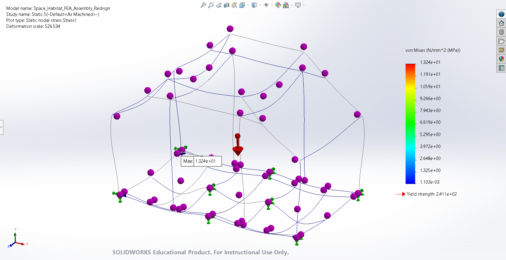
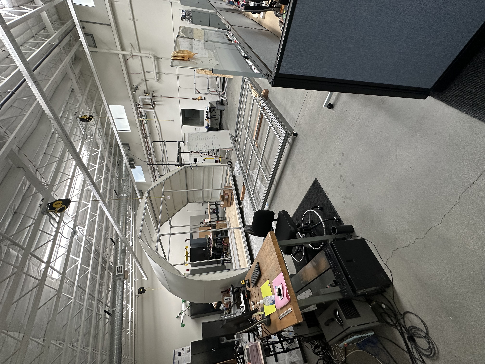
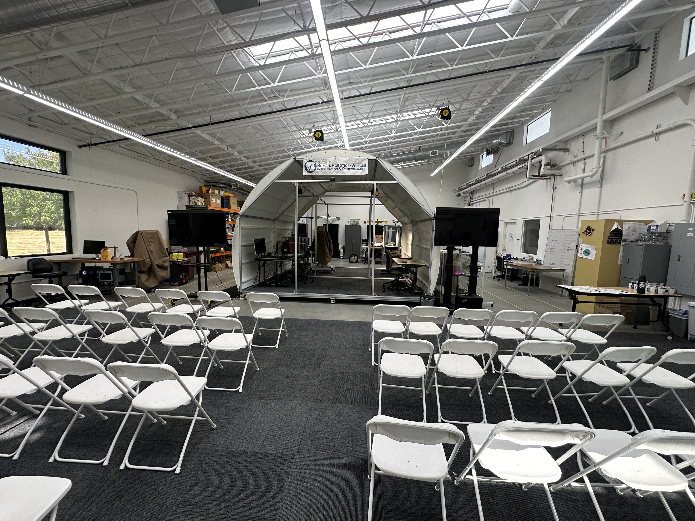

# Deep Space Habitat Analogue
Deep Space Habitat Analogue for the Final HOME review. I served as the Project Manager and Lead Engineer until it's completion in June of 2023. 

## Tool stack
- SolidWorks
- FEA Analysis
- Mechanical Drawings
- Manufacturing Tools:
  - Mills, Band Saws, Marvel Saw, Table Saw, Track Saw, Belt Sander, Lazer cutter, and Drills

## Features
- 3D CAD model of Habitat (not attached)
- Poster of Project Presented at UC Wide CAMP symposium
- Power point presented at UC Davis Summer Research Symposium
- PDF Report of the Flooring Structural FEA analysis

## Visualizations

### 1. Deep Space Habitat Analogue CAD
Photo of the CAD model made to aid in manufacturing of the Habitat. 

### 2. Habitat FEA 
One image from the Habitat FEA analysis from one of the cases studied in the structural report.

### 3. Habitat Progress Photo
A progress photo of the habitat during construction

### 4. Habitat Poster
A poster I made for the UC Wide CAMP symmposium

### 4. Habitat Finished and Staged for HOME Review
The finished and staged habitat ready for the HOME review. 

